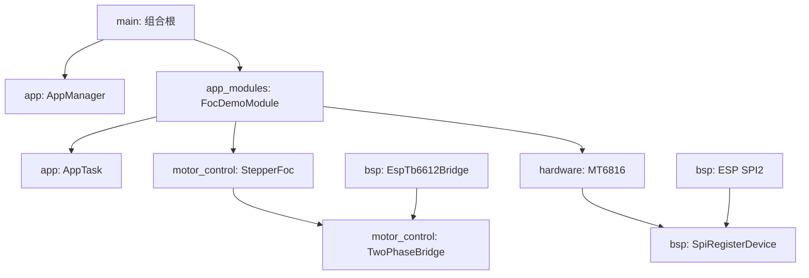

# stepmotor_driver：TB6612 架构与移植说明

## 1. 控制能力边界

TB6612FNG 是双有刷直流电机全桥驱动器，也可把两个全桥分别连接到两相步进电机的 A、B 线圈。它通过每通道 `IN1/IN2/PWM` 控制方向和平均端电压，但没有电流采样、恒流斩波或 VREF 电流调节。

因此当前软件实现的是：

```text
电角度 -> 两相正弦 -> 带符号 PWM 电压命令 -> TB6612 双 H 桥
```

它适合低幅值微步、转向和编码器验证，但不应把幅值参数称为 mA，也不能自动限制堵转电流。完整 FOC 仍需要电流采样硬件和闭环控制器。

## 2. 分层与依赖



- `motor_control` 是纯 C++，不包含 ESP-IDF 头文件，可在主机测试。
- `hardware` 只表达 MT6816 寄存器、校验和状态。
- `bsp` 独占 LEDC、GPIO、SPI 和板级引脚。
- `app_modules` 决定对象装配、任务周期和失败回滚。
- `main` 仅注册和启动模块。

## 3. TB6612 BSP

### 3.1 引脚

| 通道 | 信号 | GPIO | 实现 |
|---|---|---:|---|
| A | PWMA | 0 | LEDC channel 0 |
| A | AIN1 | 3 | GPIO output |
| A | AIN2 | 8 | GPIO output；复用板载 LED 引脚 |
| B | PWMB | 1 | LEDC channel 1 |
| B | BIN1 | 20 | GPIO output；占用 UART0 RX |
| B | BIN2 | 21 | GPIO output；占用 UART0 TX |
| 公共 | STBY | 10 | GPIO output，低电平停机 |
| 编码器 | SCLK/MISO/MOSI/CS | 4/5/6/7 | SPI2，4 MHz，Mode 1 |

GPIO9 保留给 BOOT 按键，GPIO2 不连接 TB6612，避免驱动板内部下拉影响启动采样。GPIO20/21 被占用后，ESP-IDF 主控制台必须使用 GPIO18/19 上的 USB Serial/JTAG；`board_config.hpp` 对此有编译期检查。

GPIO21 在 ROM 启动阶段仍可能输出串口信息。TB6612 数据手册给出 `STBY` 内部 200 kΩ 下拉，因此只要模块没有把 STBY 硬接高，功率级在应用初始化前保持关闭。

### 3.2 真值与带符号占空比

`PhaseDuty` 范围为 `-1023..1023`：

| 命令 | IN1 | IN2 | PWM | 结果 |
|---|---:|---:|---:|---|
| 正 | 1 | 0 | `abs(duty)` | 正向驱动 |
| 负 | 0 | 1 | `abs(duty)` | 反向驱动 |
| 0 | 0 | 0 | 0 | 高阻停止 |
| 禁能 | 任意 | 任意 | 任意 | `STBY=0`，功率级关闭 |

方向发生变化时，BSP 先把该相 PWM 清零，再改变方向，最后写入新占空比。两相都准备完成后才把 STBY 拉高。任一步骤失败都会立即执行 `disable()`。

如果电机方向或编码器方向相反，可在 `Tb6612BridgeConfig` 中设置 `invert_phase_a` 或 `invert_phase_b`，无需修改算法。

## 4. 正弦电压矢量

电角度周期为 1024 点：

```text
phase_b = sin(index)
phase_a = sin(index + 256)
index   = index & 0x03ff
```

使用 257 点四分之一 Q12 正弦表，通过象限对称性重建完整波形。幅值改为无量纲千分比：

```text
applied_amplitude = min(requested_amplitude, 1000)
peak_duty = round(applied_amplitude * 1023 / 1000)
phase_duty = peak_duty * sine_q12 / 4096
```

例如 `amplitude=100` 只表示正弦峰值约 10% PWM。实际线圈电流由 VM、电机电阻/电感、反电动势、PWM 频率和 TB6612 导通压降共同决定。

## 5. 初始化与停机时序

启动：

```text
STBY 配为输出并保持 0
  -> AIN/BIN 全部配置为输出并置 0
  -> 两路 LEDC 配置为 20 kHz、10 bit、duty=0
  -> MT6816 SPI 初始化
  -> worker 任务启动
  -> 只有收到有效的非禁能命令时才置 STBY=1
```

停止：

```text
STBY=0
  -> PWMA/PWMB=0
  -> AIN/BIN=0
  -> 释放 SPI 与 GPIO/LEDC
```

应用模块初始化失败时逆序回滚。worker 退出时也会调用 `StepperFoc::disable()`。

## 6. ESP32-C3 引脚权衡

- GPIO8 是启动配置脚，但正常 SPI Boot 不依赖其固定电平；SuperMini 板载 LED 会随 AIN2 亮灭。
- GPIO20/21 原本是 UART0，固件已将主控制台迁移到 USB Serial/JTAG。
- ROM 在应用启动前的 GPIO21 输出由 STBY 低电平隔离，不能把 STBY 硬件常高。
- GPIO2、GPIO9 未分配，避免 TB6612 的 200 kΩ 输入下拉或 BOOT 按键影响启动。
- 现有 11 个控制/编码器引脚已经占满可接受资源，不能再直接分配 TWAI。

## 7. MT6816

设备层读取 `0x03/0x04`，组合 14 bit 原始角度，检查偶校验和无磁铁标志，单次调用最多重试三次。MT6816 只依赖 `SpiRegisterDevice` 抽象，不知道 ESP32 GPIO 或 SPI host。

## 8. 从电压微步到闭环 FOC

建议演进顺序：

1. 测量电机两相电阻、电感、额定电流和实际 VM，确定安全 PWM 上限。
2. 增加每相/母线电流采样、ADC 偏置校准和硬件过流关断。
3. 建立固定周期控制执行器，测量 SPI、ADC 和算法最坏执行时间。
4. 完成编码器零点、方向、机械角到电角度映射及速度估计。
5. 先闭合电流环，再加入速度环、位置环、运动规划和故障状态机。
6. 如果目标需要稳定的低速恒流微步，评估改用带内置恒流斩波的步进驱动芯片；TB6612 更适合当前验证阶段。

当前 1 ms worker 是开环 demo，不等价于 20 kHz 电流环；控制路径中不应加入日志或阻塞访问。

## 9. 验证

固件：

```powershell
idf.py -B build_refactored set-target esp32c3 build
```

主机算法测试：

```powershell
g++.exe -std=c++17 -O2 -Wall -Wextra -Wpedantic `
  tests\stepper_foc_host_test.cpp `
  components\motor_control\src\stepper_foc.cpp `
  -Icomponents\motor_control\include `
  -o stepper_foc_host_test.exe
./stepper_foc_host_test.exe
```

测试覆盖四个基准电角度、零幅值、幅值限幅、桥接口转发和禁能。

## 10. 参考

- [Toshiba TB6612FNG 产品与数据手册](https://toshiba.semicon-storage.com/us/semiconductor/product/motor-driver-ics/brushed-dc-motor-driver-ics/detail.TB6612FNG.html)
- [ESP32-C3 GPIO 与启动脚说明](https://docs.espressif.com/projects/esp-idf/en/latest/esp32c3/api-reference/peripherals/gpio.html)
- [Dummy-Robot / Ctrl-Step-Driver-STM32F1-fw](https://github.com/peng-zhihui/Dummy-Robot/tree/main/2.Firmware/Ctrl-Step-Driver-STM32F1-fw)
